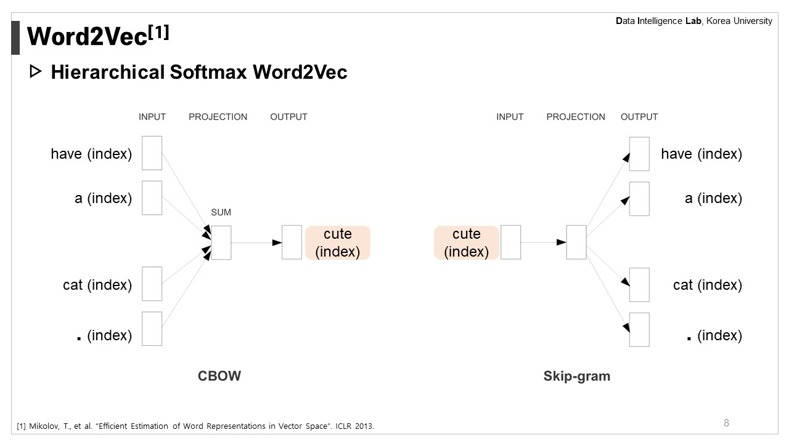
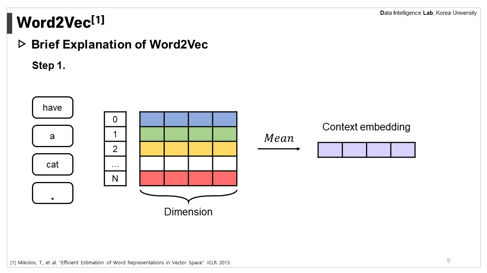
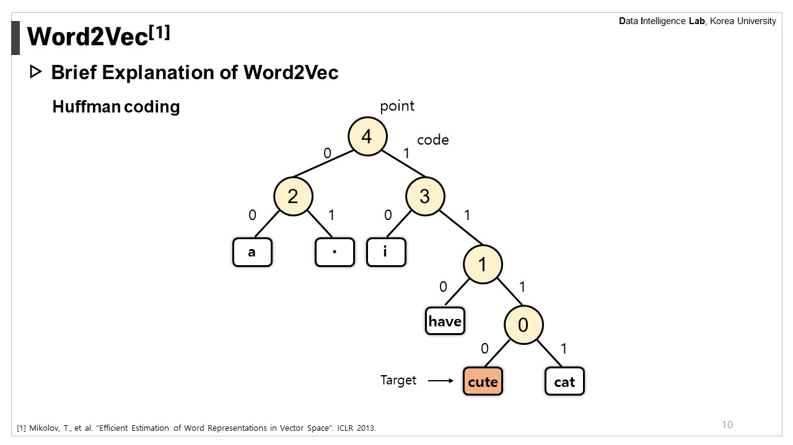
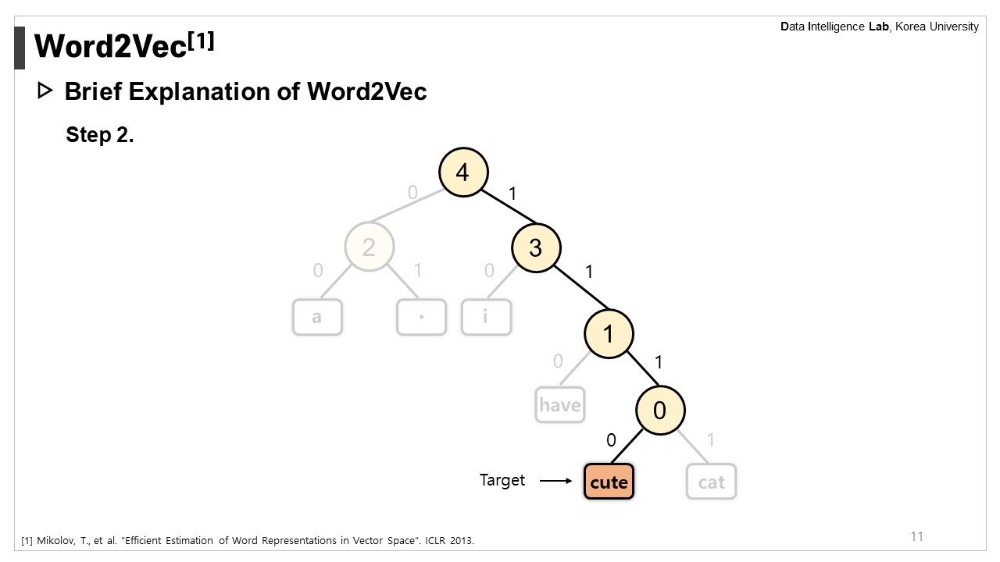
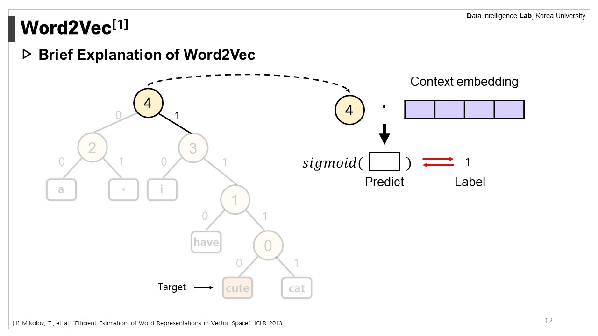
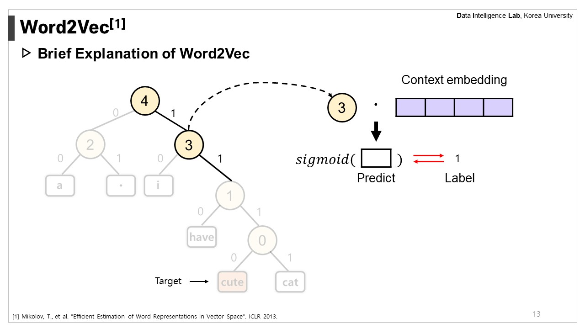
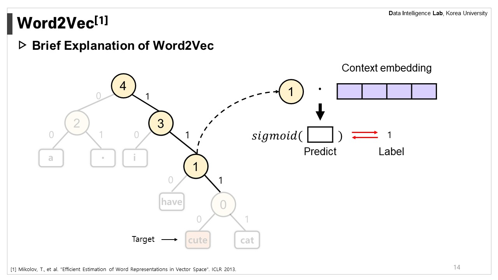
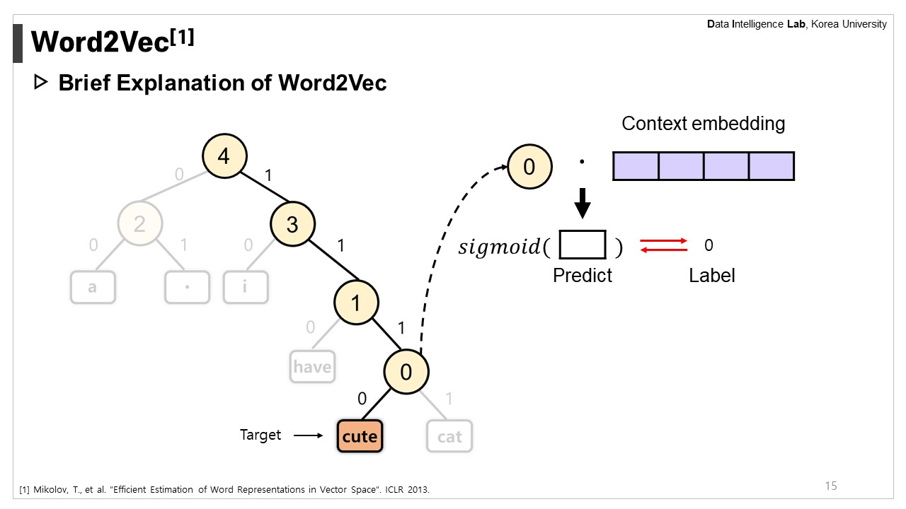

# Efficient Estimation of Word Representations in Vector Space

This is the implementation of [Efficient Estimation of Word Representations in Vector Space (T.Mikolov, et al., ICLR 2013)](https://arxiv.org/pdf/1301.3781) on python with numpy library.

## Results

Below are the experimental results corresponding to hyperparameter tuning for the Hierarchical Softmax Continuous Bag of Words model described in the paper.

(Measure: Analogy accuracy)

| Dimensionality/Training words |  Subject      | 24M  | 49M  | 98M  | 196M | 391M | 783M |
|-------------------------------|:-------------:|:----:|:----:|:----:|:----:|:----:|:----:|
| 50                            | Baseline      | 13.4 | 15.7 | 18.6 | 19.1 | 22.5 | 23.2 |
|                               | Mine          | 14.3 | 15.1 | 18.7 | 19.6 | 21.3 | 20.0 |
| 100                           | Baseline      | 19.4 | 23.1 | 27.8 | 28.7 | 33.4 | 32.2 |
|                               | Mine          | 20.0 | 23.6 | 27.2 | 30.7 | 32.1 | 33.0 |
| 300                           | Baseline      | 23.2 | 29.2 | 35.3 | 38.6 | 43.7 | 45.9 |
|                               | Mine          | 23.0 | 28.4 | 36.4 | 39.7 | 43.3 | 45.9 |
| 600                           | Baseline      | 24.0 | 30.1 | 36.5 | 40.8 | 46.6 | 50.4 |
|                               | Mine          | 23.6 | 31.6 | 38.7 | 40.7 | 44.9 | 48.3 |

## Specification
- **model.py** : Hierarchical Softmax Word2Vec implementation
- **train.py** : Training process
- **utiles.py**: Preprocessing, Measure, etc.

### Detail about Hierarchical Softmax Word2Vec

## Training Dataset
["One Billion Word Benchmark for Measuring Progress in Statistical Language Modeling"](https://github.com/ciprian-chelba/1-billion-word-language-modeling-benchmark)

    wget http://www.statmt.org/lm-benchmark/1-billion-word-language-modeling-benchmark-r13output.tar.gz
    tar -xvf 1-billion-word-language-modeling-benchmark-r13output.tar.gz

## Development Environment
- OS: Ubuntu 18.04.5 LTS (64bit)
- Language: Python 3.10.13
- CPU: Intel(R) Core(TM) i7-8700K CPU @ 3.70GHz

## Requirements
    numpy==1.26.3

## Execution
    python train.py --model hscbow --file_num 3 --hidden_size 300 --max_epoch 1